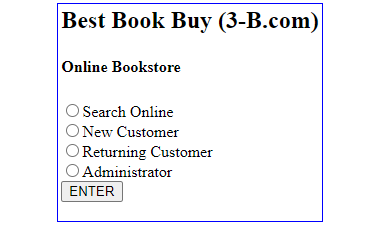
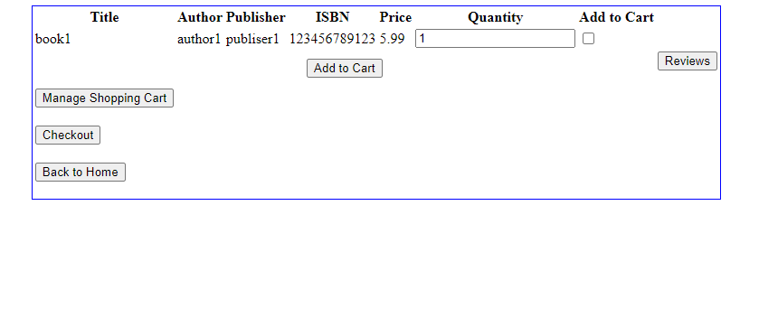
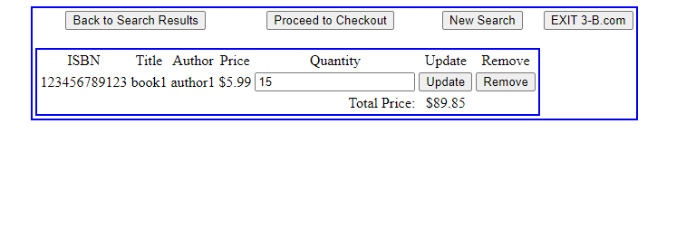

# COSC-471

This is a clone of the early Amazon bookstore since Amazon started as a company that sold books online.
Users can login, view books, write reviews, add to cart, and checkout.

**Tech**

This webapp uses a CSS and HTML frontend with a PHP backend and a MySQL DB. It was hosted on a Digital Ocean NGINX server but I have since shut that down.

**Images**

ER diagram for the conceptual phase of the DB.

Main page.

Book Search.

Cart.
